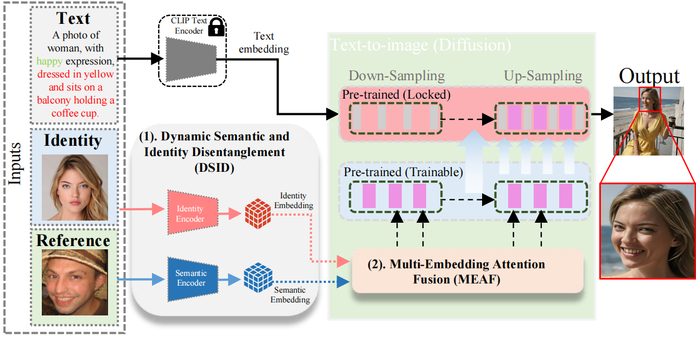
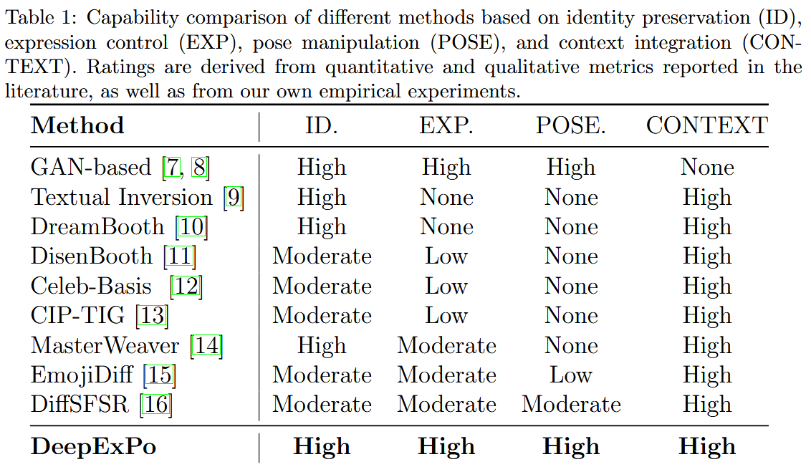
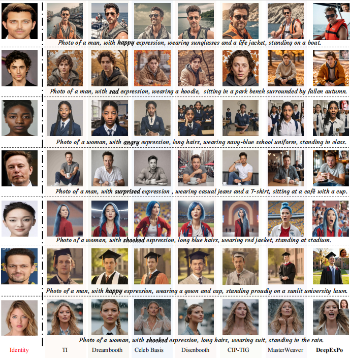
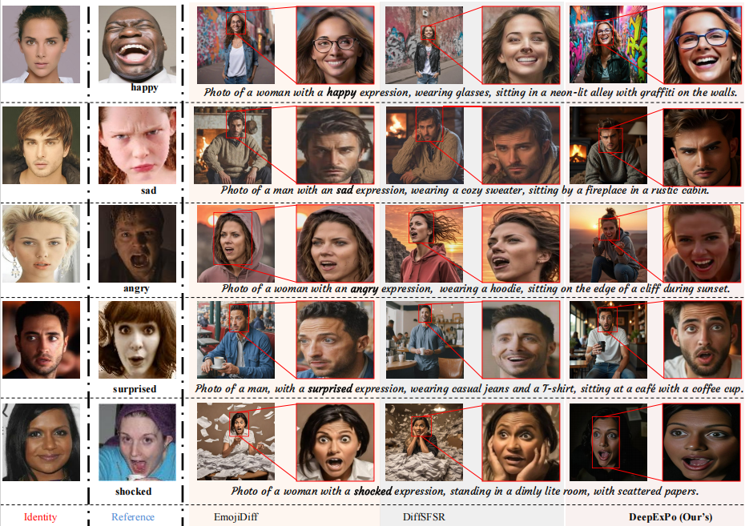
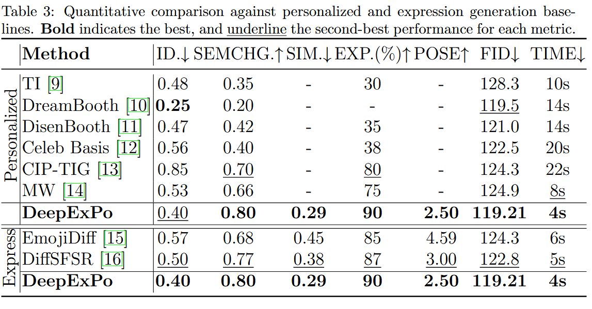

# DeepExPo

**Facial Expression and Pose Generation via Self-Supervised Disentangled Embeddings Fusion in Text-to-Image Diffusion Models**

## 🔍 Overview

**DeepExPo** is a framework designed to provide fine-grained control over facial expression and head pose in text-to-image diffusion models, while maintaining identity preservation. Existing diffusion-based personalization methods typically fall short in expression control and pose alignment. DeepExPo overcomes these limitations through a self-supervised disentanglement strategy and adaptive embedding fusion with the U-Net of pre-trained text-to-image models.

  
**Description:** DeepExPo generates identity-preserving facial images with controllable expressions and head poses using three inputs: a text prompt for context, an identity image, and a reference image for semantic cues. Identity and semantic features are fused via the MEAF module into a pre-trained diffusion model.

  
**Description:** Capability comparison of various methods based on identity preservation, expression control, pose manipulation, and context integration. Ratings are based on literature benchmarks and our own experimental analysis.

DeepExPo introduces a two-stage solution:
- **Dynamic Semantic and Identity Disentanglement (DSID)** module  
- **Multi-Embedding Attention Fusion (MEAF)** module

This repository includes the full implementation of the **DeepExPo**.

---

## 🧠 Key Modules

### 1. Dynamic Semantic and Identity Disentanglement (DSID) Module

> 📦 `./modules/dsid/`

A self-supervised module designed to disentangle identity and dynamic semantic attributes (e.g., expressions and head pose) from single or paired image frames. This module:
- Leverages consecutive video frame pairs as implicit supervision to separate identity from both static and temporal variations
- Encodes identity and dynamic semantics into two independent latent spaces
- Enables composable conditioning on expressions and pose while preserving identity fidelity
  
### 2. Multi-Embedding Attention Fusion (MEAF) Module

The **MEAF** module employs a parallel multi-attention mechanism to fuse **semantic** and **identity embeddings** with intermediate U-Net features from a pre-trained diffusion model. This approach:

- Preserves **identity** and **facial fidelity**
- Avoids degradation typically caused by direct embedding injection
- Enables effective conditioning without disrupting spatial coherence

---
## Installation

To use **DeepExPo**, clone the repository and install the required dependencies.

### 1. Clone the Repository
```bash
git clone https://github.com/MSAfganUSTC/DeepExPo.git
cd DeepExPo
```
After cloning, the folder contains the following structure:

### 2. Repository Structure

```text
DeepExPo/
│
├── requr/
│   └── config.yaml                     # Configuration file
│
├── DeepExPo_DSID_Module/              # DSID module implementation
├── DeepExPo_MEAF_Module/              # MEAF module implementation
│
├── scripts/
│   └── DeepExPo_Inference.ipynb          # Inference script
│
├── DeepExPo_Weights/                  # Pretrained model weights
│   ├── DSID_Checkpoints/              # Checkpoints for DSID module
│   └── DeepExPo_MEAF_weights/         # Weights for MEAF module
│
├── Images/                            # Figures and illustrations used in the paper
├── samples/
│   └── subject.jpg                    # Sample input image
│
├── LICENSE                            # License file
└── README.md                          # Project documentation
```

### 3. Set Up the Environment
This project uses Conda for environment management. Make sure you have Conda installed.

Create the environment from the provided file:

```bash
conda env create -f configs/environment.yml
conda activate DeepExPo

```
The dependencies include PyTorch, Hugging Face Transformers, and other necessary packages.

### 4. Usage

### Interactive Inference (Jupyter Notebook)

All the steps for loading a model, choosing an expression, and generating images are wrapped in an easy‑to‑run notebook.

1. **Activate the environment**

   ```bash
   conda activate DeepExPo   # or mamba activate DeepExPo
   ```
2. **Launch Jupyter and open the notebook**
 ```bash
   jupyter notebook scripts/DeepExPo_Inference.ipynb

   ```
3. **Run the cells from top to bottom**
 - The first cell lets you set paths like `MODEL_PATH` to load DSID checkpoints (both identity encoder and semantic encoder).
- The second cell asks for identity and reference images to extract embeddings, and lets you specify the `output_dir`.
- Later cells handle loading the model, running inference, and saving the results.
- Generated images will appear inside the notebook and in the output directory you specified.
Below is a snapshot of the Jupyter Notebook interface used for inference:


  
## 🖼️ Inference Results
  
**Description:** DeepExPo inference samples showing accurate expression and pose synthesis while maintaining subject identity and contextual fidelity.
### 🔁 Comparison with Baselines

#### 🧑‍🎨 Personalized Generation Baselines  
  
**Description:** Qualitative comparison against personalized generation models. **DeepExPo** maintains strong identity consistency while effectively transferring facial semantics and adhering to contextual prompts.

#### 😮 Expression Generation Baselines  
  
**Description:** **DeepExPo** achieves better identity preservation and precise semantic transfer (e.g., mouth and eye region alignment) compared to other expression generation techniques.

### 📊 Quantitative Evaluation

  
**Description:** Quantitative evaluation highlights **DeepExPo**'s superior performance in identity preservation and expression accuracy. Qualitative results emphasize expression realism, head pose accuracy, and facial fidelity.

### 🎯 Additional Results

#### 🧔 Male Subjects  
  
DeepExPo successfully generates realistic male facial expressions while preserving identity.

#### 👩 Female Subjects  
  
Expression synthesis for female subjects across five expression types with high visual fidelity.

#### 🧒 Children Across Ethnic Groups  
  
Results demonstrate effective generation for young boys and girls of Indian, African, and European descent.

#### 🌍 Ethnic Diversity  
  
The model maintains identity and expression accuracy across various ethnic groups.

#### 🔄 Cross‑Identity/Reference Combinations  
  
Demonstrates flexibility in handling cross‑gender and cross‑ethnicity transformations while preserving identity.

#### 🙆‍♂️ Extreme Orientations  
 
Results show model limitations when both identity and reference inputs have extreme head poses, reflecting the boundaries of identity fidelity under such conditions.
---

### ✅ Conclusion

DeepExPo demonstrates robust performance in identity-preserving facial expression synthesis across diverse subjects, conditions, and contexts. Its ability to handle complex semantic cues and maintain realism positions it as a strong foundation for personalized human image generation in real-world applications.

---
## License

This project is licensed under the MIT License. See the [LICENSE](LICENSE) file for more details.

## Acknowledgments

- **Diffusion Models**: We used diffusion-based image generation techniques for creating high-quality images.
- **Open Source Tools**: The project leverages various open-source libraries such as PyTorch, Hugging Face Transformers, and others.

### 📬 Contact

For questions, collaboration, or code access, please contact:  
**Muhammad Afgan**  
✉️ [msafgan@mail.ustc.edu.cn]  

